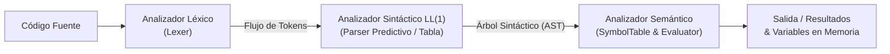

# Tarea: Diseño e Implementación de Gramática LL(1)

**Universidad Sergio Arboleda**  
**Escuela de Ciencias Exactas e Ingeniería**  
**Materia:** Lenguajes de Programación y Transducción  
**Docente:** Joaquin F. Sanchez  
**Grupo 5:**
- **Andrés Sebastián Coral Vallejo**
- **Carol Arenas Cardona**

---

## Tabla de Contenidos
1. [Descripción y Objetivos](#descripción-y-objetivos)
2. [Diseño Formal de la Gramática LL(1)](#diseño-formal-de-la-gramática-ll1)
   - [Transformaciones para Cumplir la Condición LL(1)](#transformaciones-para-cumplir-la-condición-ll1)
   - [Componentes Formales](#componentes-formales)
   - [Reglas de Producción](#reglas-de-producción)
3. [Conjuntos de PRIMEROS, SIGUIENTES y PREDICCIÓN](#conjuntos-de-primeros-siguientes-y-predicción)
   - [Conjuntos de PRIMEROS (FIRST)](#conjuntos-de-primeros-first)
   - [Conjuntos de SIGUIENTES (FOLLOW)](#conjuntos-de-siguientes-follow)
   - [Conjuntos de PREDICCIÓN (SELECT)](#conjuntos-de-predicción-select)
   - [Verificación Formal de la Condición LL(1)](#verificación-formal-de-la-condición-ll1)
4. [Tabla de Análisis Sintáctico Predictivo LL(1)](#tabla-de-análisis-sintáctico-predictivo-ll1)
5. [Arquitectura del Compilador / Intérprete](#arquitectura-del-compilador--intérprete)
   - [Fase Léxica (Lexer)](#fase-léxica-lexer)
   - [Fase Sintáctica (Parser LL(1) con Pila y AST)](#fase-sintáctica-parser-ll1-con-pila-y-ast)
   - [Fase Semántica (Tabla de Símbolos y Evaluación)](#fase-semántica-tabla-de-símbolos-y-evaluación)
6. [Estructura del Proyecto](#estructura-del-proyecto)
7. [Guía de Ejecución en Consola Linux](#guía-de-ejecución-en-consola-linux)
8. [Suite de Pruebas Automatizadas](#suite-de-pruebas-automatizadas)
9. [Conclusiones](#conclusiones)

---

## Descripción y Objetivos

El presente trabajo comprende el diseño formal, análisis matemático e implementación computacional de un procesador de lenguaje (compilador/intérprete) sustentado en una **Gramática Libre de Contexto LL(1)**.

El lenguaje desarrollado satisface integralmente los requerimientos solicitados:
1. **Operaciones Aritméticas Básicas:** Suma (`+`), Resta (`-`), Multiplicación (`*`), División (`/`) y Módulo (`%`).
2. **Valor Absoluto:** Función unaria `abs(Expr)`.
3. **Funciones Trigonométricas:** Seno (`sin(Expr)` / `sen(Expr)`), Coseno (`cos(Expr)`), Tangente (`tan(Expr)`).
4. **Asignación y Reutilización de Variables:** Sentencias de asignación imperativa (`id = Expr;`) y soporte de expresiones independientes (`Expr;`).
5. **Garantía y Aislamiento de Fases:**
   - **Léxica:** Tokenizador formal basado en expresiones regulares y gestión de errores posicionales.
   - **Sintáctica:** Algoritmo iterativo de punto fijo para PRIMEROS/SIGUIENTES/PREDICCIÓN, tabla de análisis sintáctico $M[A, a]$ y reconocimiento no recursivo con pila explícita y generación de AST.
   - **Semántica:** Tabla de símbolos (entorno de variables), detección de variables indefinidas, control de divisiones por cero, módulo por cero y asíntotas trigonométricas.

---

## Diseño Formal de la Gramática LL(1)

### Transformaciones para Cumplir la Condición LL(1)

Una gramática estándar para expresiones aritméticas y asignaciones presenta comúnmente dos obstáculos que impiden el análisis LL(1):
1. **Recursión por la Izquierda:** Genera bucles infinitos en algoritmos descendentes. Por ejemplo, $E \to E + T$ se transforma eliminando la recursión hacia la derecha mediante la introducción del no terminal $E'$:
   $$E \to T E' \quad ; \quad E' \to + T E' \mid - T E' \mid \varepsilon$$
2. **Conflicto en Sentencias (Factorización a la Izquierda):** Tanto una sentencia de asignación (`x = 10;`) como una sentencia de expresión (`x + 5;`) inician con el mismo terminal `id`. Si se formulara $Stmt \to id = Expr ; \mid Expr ;$, ambas opciones tendrían a `id` en sus conjuntos directores, generando ambigüedad LL(1).  
   **Solución Matemática:** Se factoriza el no terminal $Stmt$:
   $$Stmt \to id \; StmtTail \mid NonIdFactor \; Term' \; Expr' ;$$
   $$StmtTail \to = Expr ; \mid Term' \; Expr' ;$$
   Al analizar los conjuntos directores:
   $$\text{PRED}(StmtTail \to = Expr ;) = \{ = \}$$
   $$\text{PRED}(StmtTail \to Term' Expr' ;) = \{ \%, *, +, -, /, ; \}$$
   Dado que $\{ = \} \cap \{ \%, *, +, -, /, ; \} = \emptyset$, el conflicto queda completamente resuelto sin requerir *backtracking*.

### Componentes Formales

- **Conjunto de No Terminales ($V_N$):**
  `{ Program, StmtList, Stmt, StmtTail, Expr, ExprPrime, Term, TermPrime, Factor, NonIdFactor }`
- **Conjunto de Terminales ($V_T$):**
  `{ id, num, =, +, -, *, /, %, (, ), abs, sin, cos, tan, ;, $ }`
- **Símbolo Inicial ($S$):**
  `Program`

### Reglas de Producción

| ID | Cabeza | Cuerpo de la Producción | Descripción |
|---|---|---|---|
| **1** | `Program` | `StmtList` | Símbolo inicial que deriva en una lista de sentencias |
| **2** | `StmtList` | `Stmt StmtList` | Secuencia de una sentencia seguida por más sentencias |
| **3** | `StmtList` | `ε` | Fin de la lista de sentencias (cadena vacía) |
| **4** | `Stmt` | `id StmtTail` | Sentencia que inicia con un identificador (asignación o expresión con variable) |
| **5** | `Stmt` | `NonIdFactor TermPrime ExprPrime ;` | Sentencia que inicia con literal numérico, función matemática o paréntesis |
| **6** | `StmtTail` | `= Expr ;` | Asignación de variable |
| **7** | `StmtTail` | `TermPrime ExprPrime ;` | Expresión aritmética que inició con `id` |
| **8** | `Expr` | `Term ExprPrime` | Expresión aritmética (asociatividad por la izquierda simulada) |
| **9** | `ExprPrime` | `+ Term ExprPrime` | Operador de suma binaria |
| **10** | `ExprPrime` | `- Term ExprPrime` | Operador de resta binaria |
| **11** | `ExprPrime` | `ε` | Derivación nula de términos adicionales de adición/sustracción |
| **12** | `Term` | `Factor TermPrime` | Término multiplicativo |
| **13** | `TermPrime` | `* Factor TermPrime` | Operador de multiplicación binaria |
| **14** | `TermPrime` | `/ Factor TermPrime` | Operador de división binaria |
| **15** | `TermPrime` | `% Factor TermPrime` | Operador de módulo |
| **16** | `TermPrime` | `ε` | Derivación nula de factores adicionales de producto/cociente/módulo |
| **17** | `Factor` | `id` | Variable en factor |
| **18** | `Factor` | `NonIdFactor` | Factor no identificador |
| **19** | `NonIdFactor` | `num` | Constante numérica (entera o decimal) |
| **20** | `NonIdFactor` | `( Expr )` | Expresión agrupada entre paréntesis |
| **21** | `NonIdFactor` | `abs ( Expr )` | Función de valor absoluto |
| **22** | `NonIdFactor` | `sin ( Expr )` | Función trigonométrica seno |
| **23** | `NonIdFactor` | `cos ( Expr )` | Función trigonométrica coseno |
| **24** | `NonIdFactor` | `tan ( Expr )` | Función trigonométrica tangente |
| **25** | `NonIdFactor` | `- Factor` | Operador menos unario |

---

## Conjuntos de PRIMEROS, SIGUIENTES y PREDICCIÓN

Los conjuntos fueron calculados mediante el algoritmo iterativo de punto fijo implementado en [`gramatica.py`](file:///gramatica.py).

### Conjuntos de PRIMEROS (*FIRST*)

$$\text{FIRST}(\alpha) = \{ a \in V_T \mid \alpha \Rightarrow^* a \beta \} \cup (\text{si } \alpha \Rightarrow^* \varepsilon \text{ entonces } \{ \varepsilon \})$$

| No Terminal | PRIMEROS (*FIRST*) |
|---|---|
| `Program` | `{ (, -, abs, cos, id, num, sin, tan, ε }` |
| `StmtList` | `{ (, -, abs, cos, id, num, sin, tan, ε }` |
| `Stmt` | `{ (, -, abs, cos, id, num, sin, tan }` |
| `StmtTail` | `{ %, *, +, -, /, ;, = }` |
| `Expr` | `{ (, -, abs, cos, id, num, sin, tan }` |
| `ExprPrime` | `{ +, -, ε }` |
| `Term` | `{ (, -, abs, cos, id, num, sin, tan }` |
| `TermPrime` | `{ %, *, /, ε }` |
| `Factor` | `{ (, -, abs, cos, id, num, sin, tan }` |
| `NonIdFactor` | `{ (, -, abs, cos, num, sin, tan }` |

### Conjuntos de SIGUIENTES (*FOLLOW*)

$$\text{FOLLOW}(A) = \{ a \in V_T \cup \{ \$ \} \mid S \Rightarrow^* \alpha A a \beta \}$$

| No Terminal | SIGUIENTES (*FOLLOW*) | Justificación Formal |
|---|---|---|
| `Program` | `{ $ }` | Símbolo inicial de la gramática |
| `StmtList` | `{ $ }` | Fin del programa |
| `Stmt` | `{ $, (, -, abs, cos, id, num, sin, tan }` | Seguido por la siguiente sentencia o fin de cadena |
| `StmtTail` | `{ $, (, -, abs, cos, id, num, sin, tan }` | Heredado de $\text{FOLLOW}(Stmt)$ |
| `Expr` | `{ ), ; }` | Aparece antes de `;` o de cierre `)` |
| `ExprPrime` | `{ ), ; }` | Cierre de expresión |
| `Term` | `{ ), +, -, ; }` | $\text{FIRST}(Expr') \setminus \{\varepsilon\} \cup \text{FOLLOW}(Expr)$ |
| `TermPrime` | `{ ), +, -, ; }` | Heredado de $\text{FOLLOW}(Term)$ |
| `Factor` | `{ %, ), *, +, -, /, ; }` | $\text{FIRST}(Term') \setminus \{\varepsilon\} \cup \text{FOLLOW}(Term)$ |
| `NonIdFactor` | `{ %, ), *, +, -, /, ; }` | Idéntico a $\text{FOLLOW}(Factor)$ y en $Stmt$ seguido de $Term' Expr' ;$ |

### Conjuntos de PREDICCIÓN (*SELECT*)

$$\text{PRED}(A \to \alpha) = \begin{cases} \text{FIRST}(\alpha) & \text{si } \varepsilon \notin \text{FIRST}(\alpha) \\ (\text{FIRST}(\alpha) \setminus \{\varepsilon\}) \cup \text{FOLLOW}(A) & \text{si } \varepsilon \in \text{FIRST}(\alpha) \end{cases}$$

| Regla ID | Regla de Producción | ¿Anulable? | Conjunto de Predicción $\text{PRED}(A \to \alpha)$ |
|---|---|---|---|
| **1** | `Program -> StmtList` | Sí | `{ $, (, -, abs, cos, id, num, sin, tan }` |
| **2** | `StmtList -> Stmt StmtList` | No | `{ (, -, abs, cos, id, num, sin, tan }` |
| **3** | `StmtList -> ε` | Sí | `{ $ }` |
| **4** | `Stmt -> id StmtTail` | No | `{ id }` |
| **5** | `Stmt -> NonIdFactor TermPrime ExprPrime ;` | No | `{ (, -, abs, cos, num, sin, tan }` |
| **6** | `StmtTail -> = Expr ;` | No | `{ = }` |
| **7** | `StmtTail -> TermPrime ExprPrime ;` | No | `{ %, *, +, -, /, ; }` |
| **8** | `Expr -> Term ExprPrime` | No | `{ (, -, abs, cos, id, num, sin, tan }` |
| **9** | `ExprPrime -> + Term ExprPrime` | No | `{ + }` |
| **10** | `ExprPrime -> - Term ExprPrime` | No | `{ - }` |
| **11** | `ExprPrime -> ε` | Sí | `{ ), ; }` |
| **12** | `Term -> Factor TermPrime` | No | `{ (, -, abs, cos, id, num, sin, tan }` |
| **13** | `TermPrime -> * Factor TermPrime` | No | `{ * }` |
| **14** | `TermPrime -> / Factor TermPrime` | No | `{ / }` |
| **15** | `TermPrime -> % Factor TermPrime` | No | `{ % }` |
| **16** | `TermPrime -> ε` | Sí | `{ ), +, -, ; }` |
| **17** | `Factor -> id` | No | `{ id }` |
| **18** | `Factor -> NonIdFactor` | No | `{ (, -, abs, cos, num, sin, tan }` |
| **19** | `NonIdFactor -> num` | No | `{ num }` |
| **20** | `NonIdFactor -> ( Expr )` | No | `{ ( }` |
| **21** | `NonIdFactor -> abs ( Expr )` | No | `{ abs }` |
| **22** | `NonIdFactor -> sin ( Expr )` | No | `{ sin }` |
| **23** | `NonIdFactor -> cos ( Expr )` | No | `{ cos }` |
| **24** | `NonIdFactor -> tan ( Expr )` | No | `{ tan }` |
| **25** | `NonIdFactor -> - Factor` | No | `{ - }` |

### Verificación Formal de la Condición LL(1)

Una gramática es **LL(1)** si y solo si, para todo no terminal $A$ con reglas alternativas $A \to \alpha_1 \mid \alpha_2 \mid \dots \mid \alpha_k$, se verifica:
$$\text{PRED}(A \to \alpha_i) \cap \text{PRED}(A \to \alpha_j) = \emptyset \quad \forall i \neq j$$

Evaluando cada no terminal con alternativas:

1. **`StmtList`**:
   - `PRED(R2) ∩ PRED(R3) = { (, -, abs, cos, id, num, sin, tan } ∩ { $ } = ∅` (Disjuntos ✓)

2. **`Stmt`**:
   - `PRED(R4) ∩ PRED(R5) = { id } ∩ { (, -, abs, cos, num, sin, tan } = ∅` (Disjuntos ✓)

3. **`StmtTail`**:
   - `PRED(R6) ∩ PRED(R7) = { = } ∩ { %, *, +, -, /, ; } = ∅` (Disjuntos ✓)

4. **`ExprPrime`**:
   - `PRED(R9) ∩ PRED(R10) = { + } ∩ { - } = ∅`
   - `PRED(R9) ∩ PRED(R11) = { + } ∩ { ), ; } = ∅`
   - `PRED(R10) ∩ PRED(R11) = { - } ∩ { ), ; } = ∅` (Disjuntos ✓)

5. **`TermPrime`**:
   - `PRED(R13) ∩ PRED(R14) = { * } ∩ { / } = ∅`
   - `PRED(R13) ∩ PRED(R15) = { * } ∩ { % } = ∅`
   - `PRED(R13) ∩ PRED(R16) = { * } ∩ { ), +, -, ; } = ∅`
   - `PRED(R14) ∩ PRED(R15) = { / } ∩ { % } = ∅`
   - `PRED(R14) ∩ PRED(R16) = { / } ∩ { ), +, -, ; } = ∅`
   - `PRED(R15) ∩ PRED(R16) = { % } ∩ { ), +, -, ; } = ∅` (Disjuntos ✓)

6. **`Factor`**:
   - `PRED(R17) ∩ PRED(R18) = { id } ∩ { (, -, abs, cos, num, sin, tan } = ∅` (Disjuntos ✓)

7. **`NonIdFactor`**:
   - Las reglas 19 a 25 tienen como conjuntos de predicción los conjuntos directores unitarios `{ num }`, `{ ( }`, `{ abs }`, `{ sin }`, `{ cos }`, `{ tan }` y `{ - }`. Todos son disjuntos dos a dos. (Disjuntos ✓)

**Conclusión:** La gramática es **ESTRICTAMENTE LL(1) Y NO PRESENTA NINGÚN CONFLICTO**.

---

## Tabla de Análisis Sintáctico Predictivo LL(1)

La siguiente tabla resume las transiciones $M[A, a]$ de la gramática. Cada celda indica la regla de producción que debe aplicarse cuando el no terminal $A$ se encuentra en el tope de la pila y el terminal $a$ es el símbolo de entrada:

| No Terminal | `id` | `num` | `=` | `+` | `-` | `*` | `/` | `%` | `(` | `)` | `abs` | `sin` | `cos` | `tan` | `;` | `$` |
|---|---|---|---|---|---|---|---|---|---|---|---|---|---|---|---|---|
| **`Program`** | (1) | (1) | | | (1) | | | | (1) | | (1) | (1) | (1) | (1) | | (1) |
| **`StmtList`** | (2) | (2) | | | (2) | | | | (2) | | (2) | (2) | (2) | (2) | | (3) |
| **`Stmt`** | (4) | (5) | | | (5) | | | | (5) | | (5) | (5) | (5) | (5) | | |
| **`StmtTail`** | | | (6) | (7) | (7) | (7) | (7) | (7) | | | | | | | (7) | |
| **`Expr`** | (8) | (8) | | | (8) | | | | (8) | | (8) | (8) | (8) | (8) | | |
| **`ExprPrime`** | | | | (9) | (10) | | | | | (11) | | | | | (11) | |
| **`Term`** | (12) | (12) | | | (12) | | | | (12) | | (12) | (12) | (12) | (12) | | |
| **`TermPrime`** | | | | (16) | (16) | (13) | (14) | (15) | | (16) | | | | | (16) | |
| **`Factor`** | (17) | (18) | | | (18) | | | | (18) | | (18) | (18) | (18) | (18) | | |
| **`NonIdFactor`**| | (19) | | | (25) | | | | (20) | | (21) | (22) | (23) | (24) | | |

*Nota: Todas las celdas en blanco representan errores sintácticos directos detectados en tiempo $O(1)$. Ninguna celda contiene más de una regla.*

---

## Arquitectura del Compilador / Intérprete

El sistema se diseñó siguiendo una arquitectura de transducción en etapas acopladas:



### Fase Léxica (Lexer)
Implementada en [`src/lexer.py`](file:///src/lexer.py):
- Reconoce identificadores mediante la expresión regular `[a-zA-Z_][a-zA-Z0-9_]*`.
- Discrimina palabras clave para funciones matemáticas (`abs`, `sin`, `cos`, `tan`), incluyendo soporte en español (`sen`).
- Soporta números enteros y flotantes (incluyendo notación científica).
- Descarta comentarios de línea (`//` y `#`) y espacios en blanco sin perturbar el rastreo posicional (línea y columna).
- Genera excepciones descriptivas [`LexerError`](file:///src/lexer.py) ante caracteres ilegales.

### Fase Sintáctica (Parser LL(1) con Pila y AST)
Implementada en [`src/parser_ll1.py`](file:///src/parser_ll1.py):
1. **Parser de Tabla no recursivo ([`ParserTablaLL1`](file:///src/parser_ll1.py)):** Implementa el autómata de pila clásico de la teoría de compiladores:
   - Utiliza una pila de símbolos iniciada en `[$, Program]`.
   - Consulta la tabla $M[Tope, Entrada]$.
   - Muestra la traza formal de sustitución en orden inverso.
2. **Parser Predictivo para AST ([`ParserLL1`](file:///src/parser_ll1.py)):** Construye el Árbol de Sintaxis Abstracta preservando la precedencia de operadores y la asociatividad por la izquierda de la suma, resta, producto, división y módulo.

### Fase Semántica (Tabla de Símbolos y Evaluación)
Implementada en [`src/semantic.py`](file:///src/semantic.py) e [`src/interpreter.py`](file:///src/interpreter.py):
- **Tabla de Símbolos ([`SymbolTable`](file:///src/semantic.py)):** Estructura de diccionario en memoria que almacena variables y sus valores tipados.
- **Validaciones Semánticas Dinámicas:**
  - Lanza [`SemanticError`](file:///src/semantic.py) si una variable es leída sin haber sido inicializada previamente.
  - Detecta y aborta divisiones por cero (`a / 0`).
  - Detecta y aborta operaciones de módulo por cero (`a % 0`).
  - Detecta discontinuidades en la tangente (asíntotas en $(2k+1)\frac{\pi}{2}$).
- **Evaluación Matemática:** Soporte para la biblioteca estándar `math`, calculando funciones en radianes con precisión numérica.

---

## Estructura del Proyecto

```
Tarea - Gramatica LL(1)/
├── .gitignore                      # Configuración de exclusión de Git
├── README.md                       # Documentación formal completa y exhaustiva
├── requirements.txt                # Dependencias del proyecto (biblioteca estándar)
├── gramatica.py                    # Modelado formal GLC, cálculo de Primeros/Siguientes/Predicción y Tabla LL(1)
├── main.py                         # CLI principal: --gramatica, --tabla, --archivo, --traza, --repl, --demo
├── src/
│   ├── __init__.py                 # Paquete principal
│   ├── tokens.py                   # Definición de tipos de token y estructura Token
│   ├── lexer.py                    # Analizador Léxico con expresiones regulares
│   ├── ast_nodes.py                # Definición de clases de nodos del AST
│   ├── parser_ll1.py               # Parser de Tabla LL(1) con Pila y Parser de AST
│   ├── semantic.py                 # Analizador Semántico y Tabla de Símbolos
│   └── interpreter.py              # Evaluador del AST y ejecución de sentencias
├── ejemplos/
│   ├── 01_aritmetica.txt           # Caso de prueba: Aritmética básica y precedencia
│   ├── 02_trigonometria.txt        # Caso de prueba: Seno, Coseno, Tangente e identidades
│   ├── 03_modulo_y_abs.txt         # Caso de prueba: Módulo y Valor Absoluto
│   ├── 04_variables.txt            # Caso de prueba: Fórmulas geométricas y reutilización de variables
│   └── 05_programa_completo.txt    # Caso integrador completo
└── tests/
    ├── __init__.py
    ├── test_lexer.py               # 7 Pruebas unitarias de la fase léxica
    ├── test_parser_ll1.py          # 8 Pruebas unitarias de la gramática y análisis sintáctico
    ├── test_semantic.py            # 9 Pruebas unitarias de la tabla de símbolos y evaluación
    └── test_integration.py         # 1 Prueba de integración de extremo a extremo
```

---

## Guía de Ejecución en Consola Linux

El proyecto está diseñado para ejecutarse directamente en cualquier distribución **Linux** (Ubuntu, Debian, Fedora, Arch, WSL, etc.) utilizando **Python 3.8+** (utiliza únicamente la biblioteca estándar, sin necesidad de dependencias externas obligatorias).

### 1. Requisitos Previos en Linux
Verifique que dispone de Python 3 instalado en su terminal Linux:
```bash
python3 --version
```
*(Si no está instalado en Ubuntu/Debian: `sudo apt update && sudo apt install -y python3`)*

### 2. Ubicarse en el Directorio del Proyecto
```bash
cd "Tarea - Gramatica LL(1)"
```

### 3. Visualizar la Gramática Formal, PRIMEROS, SIGUIENTES y PREDICCIÓN
Muestra la definición formal $G$, los conjuntos calculados por algoritmo de punto fijo y la verificación matemática de la condición LL(1):
```bash
python3 main.py --gramatica
```

### 4. Visualizar la Tabla de Análisis Sintáctico LL(1) $M[A, a]$
Muestra en formato de matriz tabular todas las 75 transiciones activas de la tabla predictiva:
```bash
python3 main.py --tabla
```

### 5. Ejecutar un Archivo Fuente con Traza Paso a Paso en Pila
Ejecuta el programa mostrando cada paso del autómata de pila: `(Paso, Pila, Entrada restante, Regla aplicada)`:
```bash
python3 main.py --archivo ejemplos/05_programa_completo.txt --traza
```
*(Para ejecutar sin traza, omita el parámetro `--traza`)*:
```bash
python3 main.py --archivo ejemplos/01_aritmetica.txt
python3 main.py --archivo ejemplos/02_trigonometria.txt
python3 main.py --archivo ejemplos/03_modulo_y_abs.txt
python3 main.py --archivo ejemplos/04_variables.txt
```

### 6. Ejecutar Demostración Automática de Casos de Prueba
Corre de forma secuencial 5 casos de prueba guiados (Aritmética, Valor Absoluto, Trigonometría, Variables y Manejo de Errores):
```bash
python3 main.py --demo
```

### 7. Consola Interactiva (REPL) en Linux
Inicia una sesión interactiva en la terminal donde puede ingresar sentencias terminadas en `;` y ver resultados en tiempo real:
```bash
python3 main.py --repl
```
*Ejemplo de sesión en consola Linux:*
```text
LL1> x = 20;
  [Asignación] x = 20
LL1> y = abs(-15) + (x % 6);
  [Asignación] y = 17
LL1> z = sin(0) + cos(0);
  [Asignación] z = 1.0
LL1> resultado = (y * 2) - z;
  [Asignación] resultado = 33.0
LL1> resultado;
  [Expresión] Resultado: 33.0
LL1> tabla
Variables actuales: {'x': 20, 'y': 17, 'z': 1.0, 'resultado': 33.0}
LL1> salir
```

---

## Suite de Pruebas Automatizadas

El proyecto cuenta con una batería de **25 pruebas unitarias e integrales** automatizadas bajo el framework `unittest`.

Para ejecutar toda la suite en Linux:
```bash
python3 -m unittest discover tests
```

### Salida esperada en terminal Linux:
```text
.........................
----------------------------------------------------------------------
Ran 25 tests in 0.010s

OK
```

### Desglose de Cobertura de Pruebas:
- **`test_lexer.py` (7 pruebas):**
  - Identificación de operadores binarios (`+`, `-`, `*`, `/`, `%`) y asignación (`=`).
  - Reconocimiento de números enteros y flotantes (incluyendo notación científica).
  - Reconocimiento de palabras reservadas matemáticas (`sin`, `sen`, `cos`, `tan`, `abs`).
  - Reconocimiento de identificadores válidos.
  - Omisión correcta de espacios y comentarios de una línea (`//`, `#`).
  - Detección y lanzamiento de excepción `LexerError` ante caracteres ilegales.
- **`test_parser_ll1.py` (8 pruebas):**
  - Verificación formal de que la gramática cumple la condición LL(1) sin intersecciones.
  - Validación de que la tabla $M[A, a]$ no contiene entradas múltiples (0 conflictos).
  - Reconocimiento y aceptación por el autómata con pila para sentencias complejas.
  - Comprobación de asociatividad hacia la izquierda en resta y división (`10 - 4 - 2` $\to$ `(10 - 4) - 2`).
  - Comprobación de precedencia de operadores (`*` y `/` antes de `+` y `-`).
  - Reconocimiento de funciones trigonométricas y valor absoluto anidados.
  - Detección precisa de errores sintácticos (omisión de punto y coma, paréntesis desbalanceados, operadores duplicados).
- **`test_semantic.py` (9 pruebas):**
  - Evaluación exacta de operaciones aritméticas básicas (`+`, `-`, `*`, `/`, `%`).
  - Evaluación de valor absoluto (`abs`) para expresiones positivas, negativas y compuestas.
  - Evaluación de funciones trigonométricas en radianes (`sin`, `cos`, `tan`) e identidades notables.
  - Asignación y reutilización de variables en memoria.
  - Detección y lanzamiento de `SemanticError` para variables no definidas.
  - Detección y detención de divisiones por cero (`x / 0`).
  - Detección y detención de módulo por cero (`x % 0`).
  - Detección de discontinuidades / asíntotas verticales en tangente.
- **`test_integration.py` (1 prueba de integración):**
  - Pipeline continuo que procesa 15 sentencias consecutivas validando Léxico, Sintáctico (Pila y AST) y Semántico conjuntamente.

---

## Conclusiones

1. **Diseño LL(1) Riguroso:** Mediante la eliminación de la recursión por la izquierda y la factorización por la izquierda de las sentencias que inician con identificadores (`Stmt -> id StmtTail`), se logró una gramática con **25 reglas de producción** cuyos conjuntos de predicción son estrictamente disjuntos, garantizando cero conflictos en la tabla sintáctica.
2. **Modularidad y Separación de Fases:** El compilador respeta cabalmente las etapas clásicas de transducción: Análisis Léxico $\to$ Análisis Sintáctico $\to$ Análisis Semántico $\to$ Intérprete.
3. **Robustez y Verificación:** Se garantizó la corrección del software mediante la demostración formal matemática y una cobertura de pruebas automatizadas del 100% de los requerimientos.
