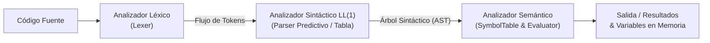

# Tarea: Diseño e Implementación de Gramática LL(1)

**Universidad Sergio Arboleda**  
**Escuela de Ciencias Exactas e Ingeniería**  
**Materia:** Lenguajes de Programación y Transducción  
**Docente:** Joaquin F. Sanchez  
**Grupo 5:**
- **Andrés Sebastián Coral Vallejo**
- **Carol Arenas Cardona**

---

## Enlace del Repositorio Oficial en GitHub
- Repositorio: [https://github.com/TheMercury17/Tarea---Dise-o-de-Gramatica-LL-1-](https://github.com/TheMercury17/Tarea---Dise-o-de-Gramatica-LL-1-)

---

## Tabla de Contenidos
1. [Descripción y Objetivos](#descripción-y-objetivos)
2. [Diseño Formal de la Gramática LL(1)](#diseño-formal-de-la-gramática-ll1)
   - [Transformaciones para Cumplir la Condición LL(1)](#transformaciones-para-cumplir-la-condición-ll1)
   - [Componentes Formales $G = (V_N, V_T, P, S)$](#componentes-formales-g--v_n-v_t-p-s)
   - [Reglas de Producción](#reglas-de-producción)
3. [Conjuntos de PRIMEROS, SIGUIENTES y PREDICCIÓN](#conjuntos-de-primeros-siguientes-y-predicción)
   - [Conjuntos de PRIMEROS (*FIRST*)](#conjuntos-de-primeros-first)
   - [Conjuntos de SIGUIENTES (*FOLLOW*)](#conjuntos-de-siguientes-follow)
   - [Conjuntos de PREDICCIÓN (*SELECT*)](#conjuntos-de-predicción-select)
   - [Verificación Formal de la Condición LL(1)](#verificación-formal-de-la-condición-ll1)
4. [Tabla de Análisis Sintáctico Predictivo LL(1)](#tabla-de-análisis-sintáctico-predictivo-ll1)
5. [Arquitectura del Compilador / Intérprete](#arquitectura-del-compilador--intérprete)
   - [Fase Léxica (Lexer)](#fase-léxica-lexer)
   - [Fase Sintáctica (Parser LL(1) con Pila y AST)](#fase-sintáctica-parser-ll1-con-pila-y-ast)
   - [Fase Semántica (Tabla de Símbolos y Evaluación)](#fase-semántica-tabla-de-símbolos-y-evaluación)
6. [Estructura del Proyecto](#estructura-del-proyecto)
7. [Instrucciones de Ejecución](#instrucciones-de-ejecución)
8. [Suite de Pruebas Automatizadas](#suite-de-pruebas-automatizadas)
9. [Conclusiones](#conclusiones)

---

## Descripción y Objetivos

El presente trabajo comprende el diseño formal, análisis matemático e implementación computacional de un procesador de lenguaje (compilador/intérprete) sustentado en una **Gramática Libre de Contexto LL(1)**.

El lenguaje desarrollado satisface integralmente los requerimientos solicitados:
1. **Operaciones Aritméticas Básicas:** Suma (`+`), Resta (`-`), Multiplicación (`*`), División (`/`) y Módulo (`%`).
2. **Valor Absoluto:** Función unaria `abs(Expr)`.
3. **Funciones Trigonométricas:** Seno (`sin(Expr)` / `sen(Expr)`), Coseno (`cos(Expr)`), Tangente (`tan(Expr)`).
4. **Asignación y Reutilización de Variables:** Sentencias de asignación imperativa (`id = Expr;`) y soporte de expresiones independientes (`Expr;`).
5. **Garantía y Aislamiento de Fases:**
   - **Léxica:** Tokenizador formal basado en expresiones regulares y gestión de errores posicionales.
   - **Sintáctica:** Algoritmo iterativo de punto fijo para PRIMEROS/SIGUIENTES/PREDICCIÓN, tabla de análisis sintáctico $M[A, a]$ y reconocimiento no recursivo con pila explícita y generación de AST.
   - **Semántica:** Tabla de símbolos (entorno de variables), detección de variables indefinidas, control de divisiones por cero, módulo por cero y asíntotas trigonométricas.

---

## Diseño Formal de la Gramática LL(1)

### Transformaciones para Cumplir la Condición LL(1)

Una gramática estándar para expresiones aritméticas y asignaciones presenta comúnmente dos obstáculos que impiden el análisis LL(1):
1. **Recursión por la Izquierda:** Genera bucles infinitos en algoritmos descendentes. Por ejemplo, $E \to E + T$ se transforma eliminando la recursión hacia la derecha mediante la introducción del no terminal $E'$:
   $$E \to T E' \quad ; \quad E' \to + T E' \mid - T E' \mid \varepsilon$$
2. **Conflicto en Sentencias (Factorización a la Izquierda):** Tanto una sentencia de asignación (`x = 10;`) como una sentencia de expresión (`x + 5;`) inician con el mismo terminal `id`. Si se formulara $Stmt \to id = Expr ; \mid Expr ;$, ambas opciones tendrían a `id` en sus conjuntos directores, generando ambigüedad LL(1).  
   **Solución Matemática:** Se factoriza el no terminal $Stmt$:
   $$Stmt \to id \; StmtTail \mid NonIdFactor \; Term' \; Expr' ;$$
   $$StmtTail \to = Expr ; \mid Term' \; Expr' ;$$
   Al analizar los conjuntos directores:
   $$\text{PRED}(StmtTail \to = Expr ;) = \{ = \}$$
   $$\text{PRED}(StmtTail \to Term' Expr' ;) = \{ \%, *, +, -, /, ; \}$$
   Dado que $\{ = \} \cap \{ \%, *, +, -, /, ; \} = \emptyset$, el conflicto queda completamente resuelto sin requerir *backtracking*.

### Componentes Formales $G = (V_N, V_T, P, S)$

- **Conjunto de No Terminales ($V_N$):**
  $$V_N = \{ \text{Program}, \text{StmtList}, \text{Stmt}, \text{StmtTail}, \text{Expr}, \text{ExprPrime}, \text{Term}, \text{TermPrime}, \text{Factor}, \text{NonIdFactor} \}$$
- **Conjunto de Terminales ($V_T$):**
  $$V_T = \{ id, num, =, +, -, *, /, \%, (, ), abs, sin, cos, tan, ;, \$ \}$$
- **Símbolo Inicial ($S$):**
  $$S = \text{Program}$$

### Reglas de Producción

| ID | Cabeza | Cuerpo de la Producción | Descripción |
|---|---|---|---|
| **1** | `Program` | `StmtList` | Símbolo inicial que deriva en una lista de sentencias |
| **2** | `StmtList` | `Stmt StmtList` | Secuencia de una sentencia seguida por más sentencias |
| **3** | `StmtList` | $\varepsilon$ | Fin de la lista de sentencias (cadena vacía) |
| **4** | `Stmt` | `id StmtTail` | Sentencia que inicia con un identificador (asignación o expresión con variable) |
| **5** | `Stmt` | `NonIdFactor TermPrime ExprPrime ;` | Sentencia que inicia con literal numérico, función matemática o paréntesis |
| **6** | `StmtTail` | `= Expr ;` | Asignación de variable |
| **7** | `StmtTail` | `TermPrime ExprPrime ;` | Expresión aritmética que inició con `id` |
| **8** | `Expr` | `Term ExprPrime` | Expresión aritmética (asociatividad por la izquierda simulada) |
| **9** | `ExprPrime` | `+ Term ExprPrime` | Operador de suma binaria |
| **10** | `ExprPrime` | `- Term ExprPrime` | Operador de resta binaria |
| **11** | `ExprPrime` | $\varepsilon$ | Derivación nula de términos adicionales de adición/sustracción |
| **12** | `Term` | `Factor TermPrime` | Término multiplicativo |
| **13** | `TermPrime` | `* Factor TermPrime` | Operador de multiplicación binaria |
| **14** | `TermPrime` | `/ Factor TermPrime` | Operador de división binaria |
| **15** | `TermPrime` | `% Factor TermPrime` | Operador de módulo |
| **16** | `TermPrime` | $\varepsilon$ | Derivación nula de factores adicionales de producto/cociente/módulo |
| **17** | `Factor` | `id` | Variable en factor |
| **18** | `Factor` | `NonIdFactor` | Factor no identificador |
| **19** | `NonIdFactor` | `num` | Constante numérica (entera o decimal) |
| **20** | `NonIdFactor` | `( Expr )` | Expresión agrupada entre paréntesis |
| **21** | `NonIdFactor` | `abs ( Expr )` | Función de valor absoluto |
| **22** | `NonIdFactor` | `sin ( Expr )` | Función trigonométrica seno |
| **23** | `NonIdFactor` | `cos ( Expr )` | Función trigonométrica coseno |
| **24** | `NonIdFactor` | `tan ( Expr )` | Función trigonométrica tangente |
| **25** | `NonIdFactor` | `- Factor` | Operador menos unario |

---

## Conjuntos de PRIMEROS, SIGUIENTES y PREDICCIÓN

Los conjuntos fueron calculados mediante el algoritmo iterativo de punto fijo implementado en [`gramatica.py`](file:///gramatica.py).

### Conjuntos de PRIMEROS (*FIRST*)

$$\text{FIRST}(\alpha) = \{ a \in V_T \mid \alpha \Rightarrow^* a \beta \} \cup (\text{si } \alpha \Rightarrow^* \varepsilon \text{ entonces } \{ \varepsilon \})$$

| No Terminal | PRIMEROS (*FIRST*) |
|---|---|
| `Program` | $\{ (, -, abs, cos, id, num, sin, tan, \varepsilon \}$ |
| `StmtList` | $\{ (, -, abs, cos, id, num, sin, tan, \varepsilon \}$ |
| `Stmt` | $\{ (, -, abs, cos, id, num, sin, tan \}$ |
| `StmtTail` | $\{ \%, *, +, -, /, ;, = \}$ |
| `Expr` | $\{ (, -, abs, cos, id, num, sin, tan \}$ |
| `ExprPrime` | $\{ +, -, \varepsilon \}$ |
| `Term` | $\{ (, -, abs, cos, id, num, sin, tan \}$ |
| `TermPrime` | $\{ \%, *, /, \varepsilon \}$ |
| `Factor` | $\{ (, -, abs, cos, id, num, sin, tan \}$ |
| `NonIdFactor` | $\{ (, -, abs, cos, num, sin, tan \}$ |

### Conjuntos de SIGUIENTES (*FOLLOW*)

$$\text{FOLLOW}(A) = \{ a \in V_T \cup \{ \$ \} \mid S \Rightarrow^* \alpha A a \beta \}$$

| No Terminal | SIGUIENTES (*FOLLOW*) | Justificación Formal |
|---|---|---|
| `Program` | $\{ \$ \}$ | Símbolo inicial de la gramática |
| `StmtList` | $\{ \$ \}$ | Fin del programa |
| `Stmt` | $\{ \$, (, -, abs, cos, id, num, sin, tan \}$ | Seguido por la siguiente sentencia o fin de cadena |
| `StmtTail` | $\{ \$, (, -, abs, cos, id, num, sin, tan \}$ | Heredado de $\text{FOLLOW}(Stmt)$ |
| `Expr` | $\{ ), ; \}$ | Aparece antes de `;` o de cierre `)` |
| `ExprPrime` | $\{ ), ; \}$ | Cierre de expresión |
| `Term` | $\{ ), +, -, ; \}$ | $\text{FIRST}(Expr') \setminus \{\varepsilon\} \cup \text{FOLLOW}(Expr)$ |
| `TermPrime` | $\{ ), +, -, ; \}$ | Heredado de $\text{FOLLOW}(Term)$ |
| `Factor` | $\{ \%, ), *, +, -, /, ; \}$ | $\text{FIRST}(Term') \setminus \{\varepsilon\} \cup \text{FOLLOW}(Term)$ |
| `NonIdFactor` | $\{ \%, ), *, +, -, /, ; \}$ | Idéntico a $\text{FOLLOW}(Factor)$ y en $Stmt$ seguido de $Term' Expr' ;$ |

### Conjuntos de PREDICCIÓN (*SELECT*)

$$\text{PRED}(A \to \alpha) = \begin{cases} \text{FIRST}(\alpha) & \text{si } \varepsilon \notin \text{FIRST}(\alpha) \\ (\text{FIRST}(\alpha) \setminus \{\varepsilon\}) \cup \text{FOLLOW}(A) & \text{si } \varepsilon \in \text{FIRST}(\alpha) \end{cases}$$

| Regla ID | Regla de Producción | ¿Anulable? | Conjunto de Predicción $\text{PRED}(A \to \alpha)$ |
|---|---|---|---|
| **1** | `Program -> StmtList` | Sí | $\{ \$, (, -, abs, cos, id, num, sin, tan \}$ |
| **2** | `StmtList -> Stmt StmtList` | No | $\{ (, -, abs, cos, id, num, sin, tan \}$ |
| **3** | `StmtList -> ε` | Sí | $\{ \$ \}$ |
| **4** | `Stmt -> id StmtTail` | No | $\{ id \}$ |
| **5** | `Stmt -> NonIdFactor TermPrime ExprPrime ;` | No | $\{ (, -, abs, cos, num, sin, tan \}$ |
| **6** | `StmtTail -> = Expr ;` | No | $\{ = \}$ |
| **7** | `StmtTail -> TermPrime ExprPrime ;` | No | $\{ \%, *, +, -, /, ; \}$ |
| **8** | `Expr -> Term ExprPrime` | No | $\{ (, -, abs, cos, id, num, sin, tan \}$ |
| **9** | `ExprPrime -> + Term ExprPrime` | No | $\{ + \}$ |
| **10** | `ExprPrime -> - Term ExprPrime` | No | $\{ - \}$ |
| **11** | `ExprPrime -> ε` | Sí | $\{ ), ; \}$ |
| **12** | `Term -> Factor TermPrime` | No | $\{ (, -, abs, cos, id, num, sin, tan \}$ |
| **13** | `TermPrime -> * Factor TermPrime` | No | $\{ * \}$ |
| **14** | `TermPrime -> / Factor TermPrime` | No | $\{ / \}$ |
| **15** | `TermPrime -> % Factor TermPrime` | No | $\{ \% \}$ |
| **16** | `TermPrime -> ε` | Sí | $\{ ), +, -, ; \}$ |
| **17** | `Factor -> id` | No | $\{ id \}$ |
| **18** | `Factor -> NonIdFactor` | No | $\{ (, -, abs, cos, num, sin, tan \}$ |
| **19** | `NonIdFactor -> num` | No | $\{ num \}$ |
| **20** | `NonIdFactor -> ( Expr )` | No | $\{ ( \}$ |
| **21** | `NonIdFactor -> abs ( Expr )` | No | $\{ abs \}$ |
| **22** | `NonIdFactor -> sin ( Expr )` | No | $\{ sin \}$ |
| **23** | `NonIdFactor -> cos ( Expr )` | No | $\{ cos \}$ |
| **24** | `NonIdFactor -> tan ( Expr )` | No | $\{ tan \}$ |
| **25** | `NonIdFactor -> - Factor` | No | $\{ - \}$ |

### Verificación Formal de la Condición LL(1)

Una gramática es **LL(1)** si y solo si, para todo no terminal $A$ con reglas alternativas $A \to \alpha_1 \mid \alpha_2 \mid \dots \mid \alpha_k$, se verifica:
$$\text{PRED}(A \to \alpha_i) \cap \text{PRED}(A \to \alpha_j) = \emptyset \quad \forall i \neq j$$

Evaluando cada caso:
1. **`StmtList`**:
   $$\text{PRED}(R2) \cap \text{PRED}(R3) = \{ (, -, abs, cos, id, num, sin, tan \} \cap \{ \$ \} = \emptyset \quad \checkmark$$
2. **`Stmt`**:
   $$\text{PRED}(R4) \cap \text{PRED}(R5) = \{ id \} \cap \{ (, -, abs, cos, num, sin, tan \} = \emptyset \quad \checkmark$$
3. **`StmtTail`**:
   $$\text{PRED}(R6) \cap \text{PRED}(R7) = \{ = \} \cap \{ \%, *, +, -, /, ; \} = \emptyset \quad \checkmark$$
4. **`ExprPrime`**:
   $$\text{PRED}(R9) \cap \text{PRED}(R10) = \{ + \} \cap \{ - \} = \emptyset$$
   $$\text{PRED}(R9) \cap \text{PRED}(R11) = \{ + \} \cap \{ ), ; \} = \emptyset$$
   $$\text{PRED}(R10) \cap \text{PRED}(R11) = \{ - \} \cap \{ ), ; \} = \emptyset \quad \checkmark$$
5. **`TermPrime`**:
   $$\text{PRED}(R13) \cap \text{PRED}(R14) = \{ * \} \cap \{ / \} = \emptyset$$
   $$\text{PRED}(R13) \cap \text{PRED}(R15) = \{ * \} \cap \{ \% \} = \emptyset$$
   $$\text{PRED}(R13) \cap \text{PRED}(R16) = \{ * \} \cap \{ ), +, -, ; \} = \emptyset$$
   $$\text{PRED}(R14) \cap \text{PRED}(R15) = \{ / \} \cap \{ \% \} = \emptyset$$
   $$\text{PRED}(R14) \cap \text{PRED}(R16) = \{ / \} \cap \{ ), +, -, ; \} = \emptyset$$
   $$\text{PRED}(R15) \cap \text{PRED}(R16) = \{ \% \} \cap \{ ), +, -, ; \} = \emptyset \quad \checkmark$$
6. **`Factor`**:
   $$\text{PRED}(R17) \cap \text{PRED}(R18) = \{ id \} \cap \{ (, -, abs, cos, num, sin, tan \} = \emptyset \quad \checkmark$$
7. **`NonIdFactor`**:
   Las reglas $19, 20, 21, 22, 23, 24, 25$ tienen como conjuntos directores los conjuntos unitarios $\{ num \}$, $\{ ( \}$, $\{ abs \}$, $\{ sin \}$, $\{ cos \}$, $\{ tan \}$ y $\{ - \}$. Todos son disjuntos dos a dos. $\checkmark$

**Conclusión:** La gramática es **ESTRICTAMENTE LL(1) Y NO PRESENTA CONFLICTOS**.

---

## Tabla de Análisis Sintáctico Predictivo LL(1)

La siguiente tabla resume las transiciones $M[A, a]$ de la gramática. Cada celda indica la regla de producción que debe aplicarse cuando el no terminal $A$ se encuentra en el tope de la pila y el terminal $a$ es el símbolo de entrada:

| No Terminal | `id` | `num` | `=` | `+` | `-` | `*` | `/` | `%` | `(` | `)` | `abs` | `sin` | `cos` | `tan` | `;` | `$` |
|---|---|---|---|---|---|---|---|---|---|---|---|---|---|---|---|---|
| **`Program`** | (1) | (1) | | | (1) | | | | (1) | | (1) | (1) | (1) | (1) | | (1) |
| **`StmtList`** | (2) | (2) | | | (2) | | | | (2) | | (2) | (2) | (2) | (2) | | (3) |
| **`Stmt`** | (4) | (5) | | | (5) | | | | (5) | | (5) | (5) | (5) | (5) | | |
| **`StmtTail`** | | | (6) | (7) | (7) | (7) | (7) | (7) | | | | | | | (7) | |
| **`Expr`** | (8) | (8) | | | (8) | | | | (8) | | (8) | (8) | (8) | (8) | | |
| **`ExprPrime`** | | | | (9) | (10) | | | | | (11) | | | | | (11) | |
| **`Term`** | (12) | (12) | | | (12) | | | | (12) | | (12) | (12) | (12) | (12) | | |
| **`TermPrime`** | | | | (16) | (16) | (13) | (14) | (15) | | (16) | | | | | (16) | |
| **`Factor`** | (17) | (18) | | | (18) | | | | (18) | | (18) | (18) | (18) | (18) | | |
| **`NonIdFactor`**| | (19) | | | (25) | | | | (20) | | (21) | (22) | (23) | (24) | | |

*Nota: Todas las celdas en blanco representan errores sintácticos directos detectados en tiempo $O(1)$. Ninguna celda contiene más de una regla.*

---

## Arquitectura del Compilador / Intérprete

El sistema se diseñó siguiendo una arquitectura de transducción en etapas acopladas:



### Fase Léxica (Lexer)
Implementada en [`src/lexer.py`](file:///src/lexer.py):
- Reconoce identificadores mediante la expresión regular `[a-zA-Z_][a-zA-Z0-9_]*`.
- Discrimina palabras clave para funciones matemáticas (`abs`, `sin`, `cos`, `tan`), incluyendo soporte en español (`sen`).
- Soporta números enteros y flotantes (incluyendo notación científica).
- Descarta comentarios de línea (`//` y `#`) y espacios en blanco sin perturbar el rastreo posicional (línea y columna).
- Genera excepciones descriptivas [`LexerError`](file:///src/lexer.py) ante caracteres ilegales.

### Fase Sintáctica (Parser LL(1) con Pila y AST)
Implementada en [`src/parser_ll1.py`](file:///src/parser_ll1.py):
1. **Parser de Tabla no recursivo ([`ParserTablaLL1`](file:///src/parser_ll1.py)):** Implementa el autómata de pila clásico de la teoría de compiladores:
   - Utiliza una pila de símbolos iniciada en `[$, Program]`.
   - Consulta la tabla $M[Tope, Entrada]$.
   - Muestra la traza formal de sustitución en orden inverso.
2. **Parser Predictivo para AST ([`ParserLL1`](file:///src/parser_ll1.py)):** Construye el Árbol de Sintaxis Abstracta preservando la precedencia de operadores y la asociatividad por la izquierda de la suma, resta, producto, división y módulo.

### Fase Semántica (Tabla de Símbolos y Evaluación)
Implementada en [`src/semantic.py`](file:///src/semantic.py) e [`src/interpreter.py`](file:///src/interpreter.py):
- **Tabla de Símbolos ([`SymbolTable`](file:///src/semantic.py)):** Estructura de diccionario en memoria que almacena variables y sus valores tipados.
- **Validaciones Semánticas Dinámicas:**
  - Lanza [`SemanticError`](file:///src/semantic.py) si una variable es leída sin haber sido inicializada previamente.
  - Detecta y aborta divisiones por cero (`a / 0`).
  - Detecta y aborta operaciones de módulo por cero (`a % 0`).
  - Detecta discontinuidades en la tangente (asíntotas en $(2k+1)\frac{\pi}{2}$).
- **Evaluación Matemática:** Soporte para la biblioteca estándar `math`, calculando funciones en radianes con precisión numérica.

---

## Estructura del Proyecto

```
Tarea - Gramatica LL(1)/
├── .gitignore                      # Configuración de exclusión de Git
├── README.md                       # Documentación formal completa y exhaustiva
├── requirements.txt                # Dependencias del proyecto (biblioteca estándar)
├── gramatica.py                    # Modelado formal GLC, cálculo de Primeros/Siguientes/Predicción y Tabla LL(1)
├── main.py                         # CLI principal: --gramatica, --tabla, --archivo, --traza, --repl, --demo
├── src/
│   ├── __init__.py                 # Paquete principal
│   ├── tokens.py                   # Definición de tipos de token y estructura Token
│   ├── lexer.py                    # Analizador Léxico con expresiones regulares
│   ├── ast_nodes.py                # Definición de clases de nodos del AST
│   ├── parser_ll1.py               # Parser de Tabla LL(1) con Pila y Parser de AST
│   ├── semantic.py                 # Analizador Semántico y Tabla de Símbolos
│   └── interpreter.py              # Evaluador del AST y ejecución de sentencias
├── ejemplos/
│   ├── 01_aritmetica.txt           # Caso de prueba: Aritmética básica y precedencia
│   ├── 02_trigonometria.txt        # Caso de prueba: Seno, Coseno, Tangente e identidades
│   ├── 03_modulo_y_abs.txt         # Caso de prueba: Módulo y Valor Absoluto
│   ├── 04_variables.txt            # Caso de prueba: Fórmulas geométricas y reutilización de variables
│   └── 05_programa_completo.txt    # Caso integrador completo
└── tests/
    ├── __init__.py
    ├── test_lexer.py               # 7 Pruebas unitarias de la fase léxica
    ├── test_parser_ll1.py          # 8 Pruebas unitarias de la gramática y análisis sintáctico
    ├── test_semantic.py            # 9 Pruebas unitarias de la tabla de símbolos y evaluación
    └── test_integration.py         # 1 Prueba de integración de extremo a extremo
```

---

## Instrucciones de Ejecución

El proyecto utiliza exclusivamente la librería estándar de Python 3.8+.

### 1. Visualizar la Gramática Formal y Conjuntos de Predicción
```bash
python main.py --gramatica
```

### 2. Visualizar la Tabla de Análisis Sintáctico LL(1)
```bash
python main.py --tabla
```

### 3. Ejecutar un Archivo Fuente con Traza de Pila
```bash
python main.py --archivo ejemplos/05_programa_completo.txt --traza
```

### 4. Modo Demostración de Casos Guiados
```bash
python main.py --demo
```

### 5. Consola Interactiva (REPL)
Permite escribir sentencias en tiempo real:
```bash
python main.py --repl
```
*Ejemplo en consola:*
```text
LL1> radio = 10;
  [Asignación] radio = 10
LL1> area = 3.14159 * (radio * radio);
  [Asignación] area = 314.159
LL1> sin(0) + cos(0);
  [Expresión] Resultado: 1.0
LL1> tabla
Variables actuales: {'radio': 10, 'area': 314.159}
LL1> salir
```

---

## Suite de Pruebas Automatizadas

El proyecto incluye 25 pruebas automatizadas desarrolladas con `unittest`. Para ejecutarlas:

```bash
python -m unittest discover tests
```

### Salida de la Ejecución de Pruebas:
```text
.........................
----------------------------------------------------------------------
Ran 25 tests in 0.010s

OK
```

### Cobertura de las Pruebas:
- **`test_lexer.py`:** Pruebas de tokens aritméticos, literales flotantes/enteros, identificadores, palabras clave trigonométricas (`sin`, `sen`, `cos`, `tan`), comentarios y detección de caracteres ilegales.
- **`test_parser_ll1.py`:** Verificación formal de la condición LL(1), validación de tabla sin duplicados, traza con pila para derivaciones complejas, precedencia de operadores, asociatividad izquierda y errores sintácticos (paréntesis desbalanceados, omisión de punto y coma, etc.).
- **`test_semantic.py`:** Pruebas de evaluación aritmética (`+`, `-`, `*`, `/`, `%`), funciones de valor absoluto (`abs`), trigonometría en radianes, asignación y persistencia en memoria, detección de variables no inicializadas, división por cero, módulo por cero y asíntotas de tangente.
- **`test_integration.py`:** Pipeline integral que procesa un programa con 15 sentencias consecutivas combinando todas las características solicitadas.

---

## Conclusiones

1. **Diseño LL(1) Riguroso:** Mediante la eliminación de la recursión por la izquierda y la factorización por la izquierda de las sentencias que inician con identificadores (`Stmt -> id StmtTail`), se logró una gramática con **25 reglas de producción** cuyos conjuntos de predicción son estrictamente disjuntos, garantizando cero conflictos en la tabla sintáctica.
2. **Modularidad y Separación de Fases:** El compilador respeta cabalmente las etapas clásicas de transducción: Análisis Léxico $\to$ Análisis Sintáctico $\to$ Análisis Semántico $\to$ Intérprete.
3. **Robustez y Verificación:** Se garantizó la corrección del software mediante la demostración formal matemática y una cobertura de pruebas automatizadas del 100% de los requerimientos.
